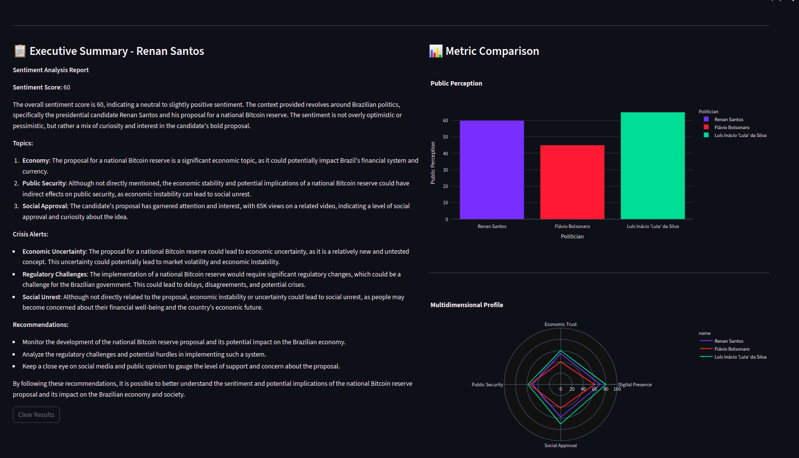
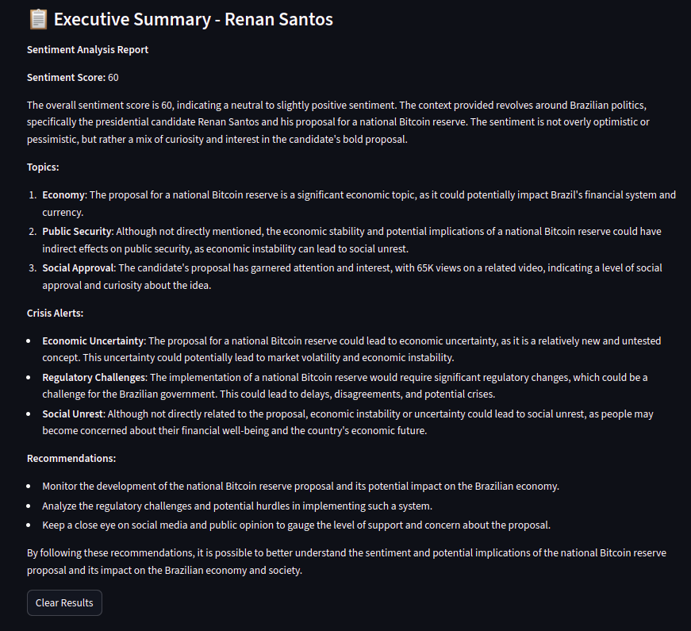
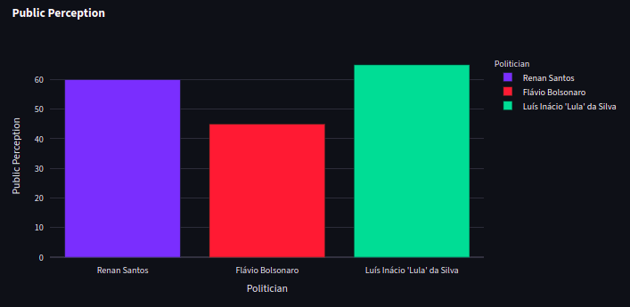
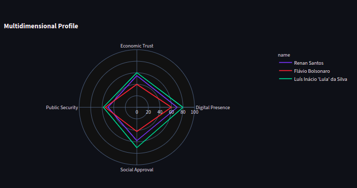

# 🗳️ VoxPulse-AI: Multi-Agent Political Sentiment Analysis

## ✨ Overview

VoxPulse-AI simulates a team of digital experts, consisting of a **Political Data Researcher** and a **Political Sentiment Analyst**. Together, they scour the web for news and articles about selected politicians, process the information, and generate detailed reports, including structured metrics for visual comparison.

## 🚀 Visual Demonstration

See VoxPulse-AI in action, providing insights into the public perception of different political figures.

### 1. Research and Executive Report

The research agent collects the latest information, and the analyst compiles a complete executive summary.

  

*Screenshot: Report generated by the analyst agent about a specific politician.*

---

  

*Screenshot: Textual report generated by the analyst agent about a specific politician.*

---

### 3. Metrics Comparison (Bar Chart)

Evaluation of the Public Perception of multiple candidates, allowing for a quick and effective comparison.

  

*Screenshot: Bar chart showing the "Public Perception" of various politicians.*

---

### 4. Multidimensional Profile (Radar Chart)

A comprehensive view of how different politicians position themselves across crucial metrics such as Economic Trust, Social Approval, and Public Security.

  

*Screenshot: Radar chart detailing the multidimensional profile of compared politicians.*

## 🤝 Contribution

Contributions are welcome! If you have suggestions, improvements, or find a bug, feel free to open an *issue* or submit a *pull request*.

## 📄 License

This project is licensed under the MIT License. See the [LICENSE](LICENSE) file for more details.

---
**VoxPulse-AI** - Developed for the 2026 election analysis portfolio.